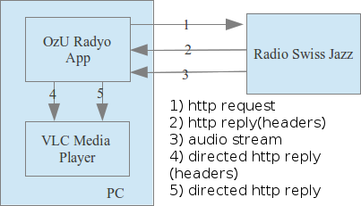
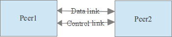
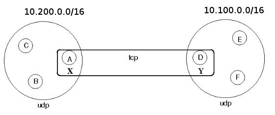
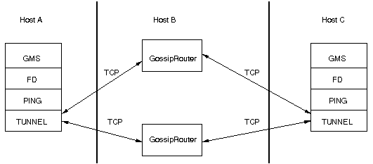
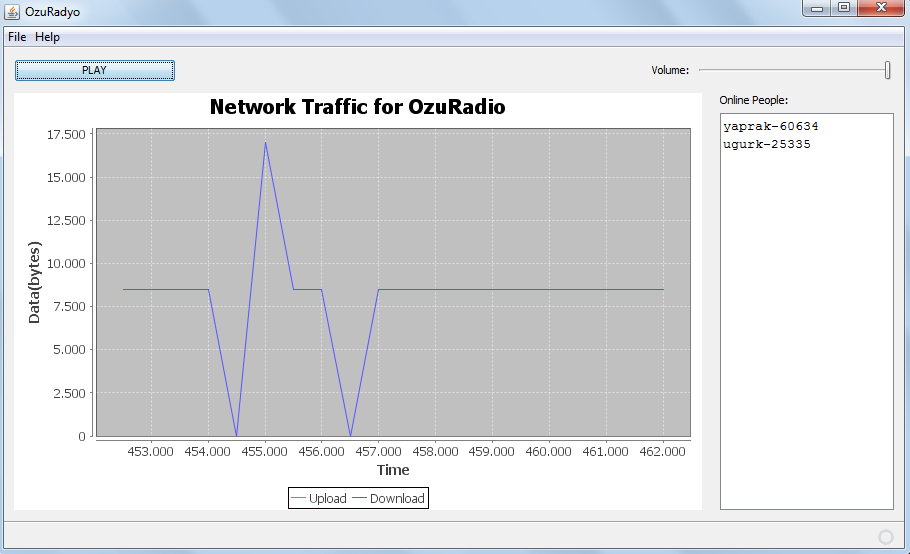

Radio Multicasting for RadyoOzu
=================

### Introduction

This project is a tool for radio multicasting from a web radio. This project is intended to be used for 
Radio Stream for Özyeğin University to overcome bandwidth problem for the “radio server” for RadyoOzu and with
this project, regardless of the number of listeners in a subnet, the “radio server” experiences a load of a 
single user.

Initially, this project is planned to be developed in a P2P manner. However, throughout development, 
tree generation and tree sharing process between the listeners occurred to be a heavy process in terms of 
time delay in a LAN. Since audio streaming is highly delaying sensitive, this delay will inhibit seamless streaming. 
Therefore, IP multicasting will be a better solution for continuous play out. However, remember that IP multicasting 
is a good solution when working in a LAN. When it comes to wide area multicasting, multicast overlay networks are 
inevitable.

In this project, basically there is a master node who takes the radio stream from web and multicasts this stream 
to all other listeners in the same subnet in the router level. When the master node leaves the group, among the 
slave nodes, one node take the responsibility of the master node, and continue broadcasting to rest.

In this document, accomplished tasks, development process and future work for this project will be described briefly.

### Accomplished Tasks

#### Obtaining a Web Radio Stream and Forwarding to Local Host

Firstly the audio stream an online radio 
(Radio Swiss Jazz, see http://livestream.srg-ssr.ch/1/rsj/mp3_128) is acquired via socket connection 
and this audio stream is forwarded to local host so that a media player such as VLC player shall 
play this audio stream. This part of the project is similar to the 5th assignment (proxy server) of CS547 class. 
Thus, codes of the proxy server are used at this part of the project. The messaging sequential is described below:

#### RadyoOzu - Data and Control Links

One of the main steps of this project is the group communication of RadyoOzu listeners. 
The group communication of RadyoOzu is developed with an open source API called JGroups. Based on this tool, 
we developed our new radio multicasting structure.

In our system, audio stream is transferred outbound, that is, the data channel and control channel are separated 
from each other. Audio stream is transferred from data link and master node selection algorithms are handled 
on control link, as shown in figure below:

Data link is meant to transmit messages reliably to many receivers. However, as it does retransmission to 
ensure lossless and ordered messages, this would hamper transmission of audio streams. For example, when a 
packet is dropped, data link is configured to retransmit it and this will result in jitter and loss of quality. 
With audio transmission, it's better to skip a missing frame rather than to retransmit it. Thus, our control 
link is configured in this manner.

#### Capabilities of Radyo OZU

The capabilities of RadyoOzu is listed and explained for the given situations below:

1. The cluster is empty a new listener is joined the group.
Since the cluster is initially empty, then this member will hold the “master” role.
“Master” is responsible to acquire the radio stream from web (see InternetSource.java) and 
also multicast this stream if there is anyone else in the cluster (see MulticastSink.java).

2. The cluster is empty and a second member is added to the cluster.

Throughout group communication this new member will understand that there is a “master” in this cluster, 
learn the address of this cluster and obtain the radio stream from this master member at router level 
(see MulticastSource.java – slave node).

3. There are two members in the cluster and master node decided to leave the cluster.

By group communication, slave node gets informed by the event of which master node leaves the cluster. 
Thus, thanks to [composition pattern](http://en.wikipedia.org/wiki/Composite_pattern) , slave node will convert 
itself to an Internet Source and continue to multicast the stream to the rest of the cluster.

4. There is one master node and several slave nodes in the cluster. Suppose that, master node decided 
to leave the cluster.

By group communication, slave nodes will be informed by the event of which master node left the cluster. 
Secondly, among the slave nodes, the first one who acquired the master flag will convert itself to master node.

#### What RadyoOzu cannot do? What is proposed to solve those problems?

1. There are two peers from different subnets and P2P communication between those peers is closed by 
IT of this network.

In this situation, we are going to negotiate with IT to give us just one computer which can connect from 
one subnet to another. Those two computers(X and Y) will be relaying computers and will allow the data transfer 
between those two subnets.

2. There are two members trying to connect each other however, firewall blocks the group communication of the member.

Since P2P communication is closed, those two members cannot see each other. This problem can be solved by tunneling 
and running a gossip router.

In this solution, a gossip router can be created on host B(outside the firewall) from a socket that firewall allows 
access. Host A will escape from firewall through Host B and successfully connect to Host C.
 
#### IP Multicasting

In RadyoOzu project, the multicasting is handled in the router level. As a starting point, this project is developed 
for LAN's. Thus, rather than P2P multicasting, IP multicasting is preferred. Given the multicast address block by 
[IANA](http://www.iana.org/assignments/ipv4-address-space/ipv4-address-space.xml) we forwarded the IP packets 
to 228.8.8.8 for multicasting.

#### Demo User Interface Sample

Demo user interface (UI) developed for this project is given below. In this UI, upload -download traffic and 
online users can be observed. In this UI, it is easily proved that independent of the number of users, upload 
traffic of the master node is constant.

Manual
======

This project is written in Java programming language. Project is developed and tested with JDK 1.7u3. 
You can download all dependencies from OzuRadyoSourceCode folder. This page also includes Java Documentations.

Libraries required to build this code is given below:
-----------------------------------------------------

* Jgroups (v.3.0.9) : communications and multicasting
* Jmf(Java Media Framework): playing media
* Mp3spi (v.1.9.5) : jmf plugin for playing mp3 files, streams etc.
* freecharts : drawing data charts and graphs
* ritonus_share.jar
* wing-worker-1.1.jar
* multiplayer.jar
* jl1.0.1.jar
* customizer.jar
* appframework-1.0.3.jar

Projects are tested on the platforms below:
-------------------------------------------

* Windows 7 with Oracle JRE
* Ubuntu with Oracle JRE
* CentOS with OpenJDK JRE

How to run the code:
-----------------------------------------------------

1. Download the executable file(jar file) from the OzuRadyoExecutable folder in the repository.
2. Double click on the jar file, press play button.
3. Enjoy the music...

